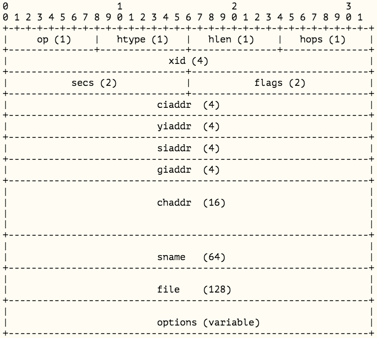
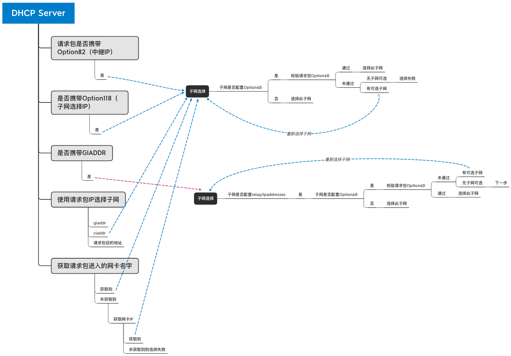

# DHCPv4 

## 简介
DHCP(Dynamic Host Configuration Protocol )是一个局域网的网络协议，使用UDP协议工作， 主要有两个用途：给内部网络或网络服务供应商自动分配IP地址，给用户或者内部网络管理员作为对所有计算机作中央管理的手段，在[RFC2131](https://tools.ietf.org/html/rfc2131)中有详细的描述。

## DHCPv4报文

* op: 报文类型，1表示请求报文(client --> server)，2表示回应报文(server --> client)
* htype: 网络硬件地址类型， 1表示client的网络硬件是10Mb/s的以太网类型
* hlen: 硬件地址长度， 以太网是6bytes
* hops: 所经路由器（relay agent）的跳数，局域网内客户端设置成0，若经过router传送，每站加1，（但是一般会规定一个最大跳数，超过就会丢弃）
* xid: 事务ID，client选择的一个随机数，用于客户端和服务器之间匹配请求和响应消息的标示，在重启或重新申请IP之前，后面的message也用这个ID
* secs: 用来表示client开始DHCP请求或更新后经过的秒数
* flags: 在client的IP地址配置之前不能接受单播报文，所以将最左一位置为1来表示server或relay agent将以广播方式将包传送给client，其余位为保留位，设置为0， 
* ciaddr: client的IP地址，只有在client拥有ip，能够响应arp请求时，并且client端处于BOUND，RENEW 或者 REBINDING 状态时才会被client填充
* yiaddr: server分配给client的IP地址，DHCP OFFER 与 DHCPACK封包中填充
* siaddr: 当需要通过网络开机时，用于bootstrap过程的Server IP， DHCP OFFER 与 DHCPACK封包中填充
* giaddr: relay agent IP, 由第一个agent填充， 后面的只增加hops，server也会根据这个字段给client分配地址
* chaddr: client硬件地址
* sname: server主机名，以null结尾的字符串
* file: boot文件名，client通过网络开机使用，以null结尾的字符串，server在DHCP OFFER中填充的路径名
* options: 可选配置参数

## client<=>server 交互流程

* DHCP Client以广播的方式发出DHCP Discover报文。client 的 MAC 地址必须包含在chaddr
* 所有的DHCP Server都能够接收到DHCP Client发送的DHCP Discover报文，所有的DHCP Server都可能会给出响应，向DHCP Client发送一个DHCP Offer报文。DHCP Offer报文中“Your(Client) IP Address”（yiaddr）字段就是DHCP Server能够提供给DHCP Client使用的IP地址，且DHCP Server会将其identifier（DHCP Server Id）放在options字段中以便DHCP Client区分不同的DHCP Server。DHCP Server在发出此报文后会存在一个已分配IP地址的纪录。
* DHCP Client只能处理其中的一个DHCP Offer报文，一般的原则是DHCP Client处理最先收到的DHCP Offer报文或之前使用过的server的。
* DHCP Client会发出一个广播的DHCP Request报文，在options字段中会加入选中的DHCP Server的identifier（DHCP Server Id）和Requested IP address（来自yiaddr）。
* DHCP Server收到DHCP Request报文后，判断options字段中的IP地址是否与自己的地址相同。如果不相同，DHCP Server不做任何处理只清除相应IP地址分配记录；如果相同，DHCP Server就会向DHCP Client响应一个DHCP ACK报文，并在options字段中增加IP地址的使用租期信息。如果IP地址被使用或者其他原因导致Server不满足Request条件，Server将要发送DHCP NAK给client，让client重新进行申请IP
* DHCP Client接收到DHCP ACK报文后，检查DHCP Server分配的IP地址是否能够使用（通过ARP）。如果可以使用，则DHCP Client成功获得IP地址并根据IP地址使用租期自动启动>续延过程；如果DHCP Client发现分配的IP地址已经被使用，则DHCP Client向DHCPServer发出DHCP Decline报文，通知DHCP Server禁用这个IP地址，然后在等待至少10秒后，DHCP Client开始新的地址申请过程。
* DHCP Client在成功获取IP地址后，随时可以通过发送DHCP Release报文释放自己的IP地址，DHCP Server收到DHCP Release报文后，会回收相应的IP地址并重新分配，这时一个dhcp获取过程结束。主机进入BOUND稳定状态。
* 一般server给client的IP地址都有租期，时间长短不等，而client会有3个计时器，当租期超过50%(T1)，这时client会发送一个单播的DHCP Request报文要求续租进入RENEW状态，DHCP Server如果响应这个报文发送ACK确认信息，这时client会重新进入BOUND状态； 假如DHCP Server没有响应主机的请求，等租期超过87.5%时(T2)，client会发送一个广播的DHCP Request报文要求续租，client进入REBINGING状态，如果这时候DHCP Server（如果IP地址不够用或其他原因）发送来一个NAK否确认信息，这时client会重新进入初始状态再次重新申请IP。如果收到ACK确认续租成功，说明这个IP还可以继续使用。如果没有响应，client只有等到IP租期耗尽，重新进入初始状态重新获取IP。

## 子网选择

