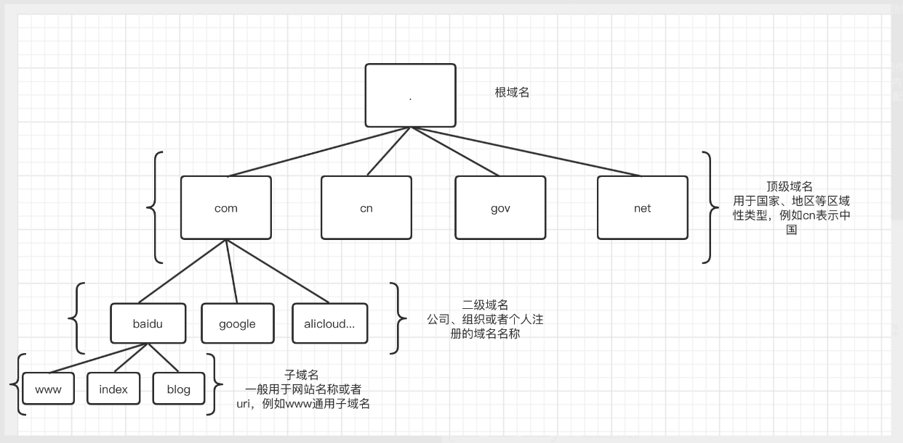

# DNS(一)

## Conception

DNS(Domain Name System)是一个分布式分级管理的数据库。他存储的是hostname与IP的对应关系、邮件路由信息以及其他互联网应用数据等等。

## Domain Name
说到DNS就离不开域名（Domain Name），因为DNS主要解析以及存储的对象是域名相关的数据。域名是一种树状结构，形如:www.baidu.com的多级文本构成，其中不同层级用"."来进行区分。同时域名的层级是从右往左递增的。例如上面的www.baidu.com从右往左开始：

* 根域名是"."，我们所看到的域名尾部并没有显示"."，但所有的域名的根域名都是"."，他是域名树的根。

* 顶级域名是:com
    * 顶级域名又分三类：国家和地区域名；通用顶级域名；新顶级域名;

    * 国家和地区域名：用于国家、地区等区域性类型。例如cn表示中国，us表示美国等等。

    * 通用顶级域名：com就是常见的通用域名，其一般表示工商企业类型，而net表示网络提供商，例如csdn.net，非营利组织的一般都是org类型。

    * 新顶级域名，就比较杂例如新出来的top,xyz,info等比较具有个性的域名。

* 二级域名是:baidu，一般是由公司、组织或者个人的名称组成。

* 子域名:www，子域名一般用于网站名称，例如www一般比用于表示网站的主页，而例如 blog.csdn.net中的blog就能一目了然的表示csdn这个网站下的blog业务模块。

* 结构树:

## DNS Resolve

这里主要讲解一下ACL、VIEW、ZONE以及RR的相关概念以及NAMED内的配置。

* ACL 
    * Access Control Lists访问权限控制，其作用类似白名单。这是防止DoS攻击的有效方法，只允许acl配置中的ip或者ip网段访问dns服务器，做到访问控制。格式:  
     `acl myacl {!10.0.0.1;10.0.0.0/24};`   
    其中myacl用于acl的命名，花括号内表示允许访问的ip或者ip段，而用“！”来表示过滤相应的IP或者IP段，匹配原则为first-match，这里表示出了10.0.0.1以外的任意10.0.0.0/24网段内的ip都可以访

    * acl还可以与options里的{allow-notify, allow-query, allow-query-on, allow-recursion, blackhole, allow-transfer,
match-clients}等搭配使用，起到更好的访问控制作用。

* VIEW
    * 视图是所有dns操作的关键，字面意思就是所见区域，相当于dns的命名空间(namespace)，只有在给定的视图区域才能有相关的dns操作，例如权威区以及资源等都依赖于视图，同时视图食欲优先级，在named的配置里，排在最上面的视图表示优先级最高，而其匹配为first-match。格式为:  
    `view myview {options:xxx;};`   

* ZONE
    * 权威区，任何资源以及重定向等配置都是在权威区内进行的，而区又是在视图内限定的。这样就组成了一个视图-权威区-资源｜重定向等的层级关系。格式为:   
    `zone myzone {type master;options:xxx;};`   

        其中options表示权威区内的各项配置，其中type最为重要，其决定了区的作用，named里给出的类型有:

        * master 权威区，每个dns必须有一个master权威区，用于权威应答，有dns域名解析请求过来都会经过权威区，由权威区进行应答。

        * slave 是权威区的一个复制，他可以做一些例如TSIG鉴权等相关的工作以减少master的负载。

        * stub 类似于slave类型的区,只不过他只拷贝master的NS记录，他并非标准的DNS配置，仅用于bind配置。

        * mirror也类似与slave区，只不过目前还处于试验阶段，并不建议用于并发比较大的情况。主要用于DNSSEC开启情况下的应答。

        * static-stub 类似与stub类型，一般存放一些static类型的配置，一般用于递归应答，如果是非递归类型的请求进入该区则会返回REFUSED。

        * forward 转发区，用于转发域名解析请求。其中会配置forwarders列表才会进行转发，有first/only两种转发模式。

        * hint 用于初始化根域名服务器列表。如果未定义，则会查找默认的根域名服务器列表。

        * redirect 重定向区，每个视图下只允许有一个重定向区。其主要作用是当正常的解析返回NXDOMAIN的时候提供应答。

        * delegation-only 代理区,设置强制代理顶级域名例如com,cn等，任何权威区的应答都会返回NXDOMAIN。并且对于转发解析请求无效。

* RESOURCE RECORDS
    * 资源是由:owner name（资源的名字）、type（资源类型）、TTL（缓存过期时间）、class(dns协议族，例如IN)、RDATA（资源记录值，不同的资源type资源记录值格式不同）组成。  

    常用的资源类型type:

        * A ipv4资源类型，资源格式:  
        owner ttl class A 192.168.0.1

        * AAAA ipv6资源类型，资源格式:  
        owner ttl class AAAA 2001::1

        * CNAME 域名指向其他的域名，相当于转发。资源格式:  
        owner ttl class CNAME cname.zone.com

        * MX 邮件域名类型，资源格式:  
        owner ttl class MX 10 mail1.zone.com，其中10表示优先级。

        * HINFO 表示主机信息，主要用于显示主机的软件硬件以及环境信息。值为文本类型格式:  
        owner ttl class HINFO "cpu_type os_type"

        * NS 用于指向那个DNS服务器进行解析，也就是解析源头。格式：  
        owner ttl IN NS name_server_domain_name

        * NAPTR 权威指针，统一资源标识符URI的一种定义格式。

        * PTR 用于域名反解析,格式:  
        owner ttl class PTR target_domain_name，  
        例如：1.0.0.10.in-addr.arpa 3600 IN PTR r1.zone.com

        * SRV 记录DNS服务器提供那些服务信息，格式:  
        service.protocol.name ttl class SRV 0 0 389 dc1.example.microsoft.com
        
        * TXT 文本资源记录，其值为文本。格式：  
        owner ttl class TXT txt_string

    常用的资源分类(class)

        * IN 表示Internet互联网，一般都是IN类型的。

        * CH Chaosnet，是一个LAN口协议，在19世纪70年代创建，目前用途较少。但是在bind的内置区内在使用。

        * HS 也是很少用的class，它是用于共享系统数据信息，例如users、groups、printer等等。  

    TTL:表示该资源在缓存中保留的时间，单位是秒。