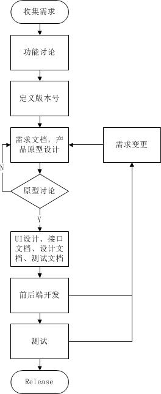
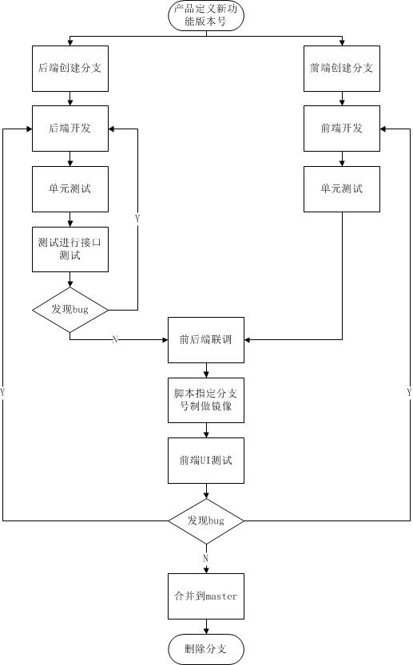
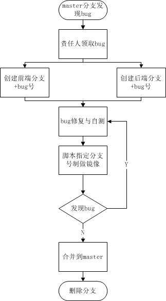
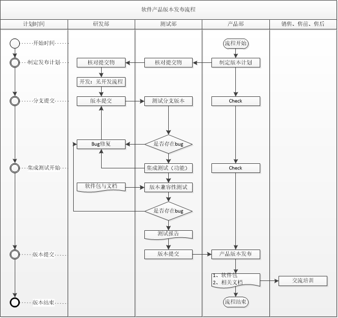

# 开发流程
1. 产品输出需求文档和产品原型，UI输出设计
2. 如果产品原型不能100%表达需求和整个交互逻辑(包含资源支持的操作以及相关资源的联动，以及这些操作和联动所期待的结果)，产品提供详细的文档说明，并且需要前后端开发同时参加过产品原型
3. 前端后端使用相同名字新的分支进行开发新功能，分支名字可以由产品提供或研发自行讨论得出
4. 测试拿到需求文档输出测试用例文档，测试用例文档可以基于大模块进行输出和更新
5. 后端开发优先输出api文档（http的接口由api文档由工具生成，websocket的接口人工写）和设计文档初稿，再进行代码开发和单元测试，代码开发完成，完善设计文档，再进行接口和功能自测，如果实现逻辑比较复杂，进行需求反讲，然后提交给测试做接口测试
6. 前端先按照产品原型，UI设计，后端api文档和设计文档进行前端开发，待测试完成接口测试后再进行联调
7. 测试拿到api文档、设计文档，前后端分支，进行功能测试，如果功能逻辑复杂，产品、开发和测试，需求开会先过测试用例，再进行测试，避免功能漏测
8. 如果bug严重到影响测试流程，导致测试无法进行，测试可以协商开发优先修复bug，否则开发继续当前开发工作
9. 测试提交bug，如果复现复杂，需要测试提供详细的复现流程（文字不好描述的可以录屏），开发根据复现流程复现，减少不必要的沟通，影响测试进度
## 产品开发流程 

## 新功能开发流程

# bug修复
1. 新功能分支的bug修复完成后，才能合到master分支
2. 多个分支共存时，属于哪一个分支的bug，就在哪一个分支上修复
3. 如果分支已经合到master，基于bug号＋功能建立新的分支进行修复
4. 禁止在新的分支修复旧功能的bug

## master bug fix流程

# 分支合并到master分支流程
1. 当前分支已经git push远端分支
2. 切换到master，git pull最新代码
3. 切换回当前分支，使用git merge master，将master分支merge到当前分支，如果有冲突，修复冲突
4. 将master分支merge到当前分支后，保证可以编译过，再git push到远端分支
5. 切换到master分支，使用git merge需要合并的分支，再git push到master的远端分支
6. 分支git push的基本前提必须可以编译过，go.mod没有本地代码分支，没有调试打印信息，单元测试可以跑过
7. 分支合到master后，删除已经合并的本地和远端的分支

# 产品发布流程

 
  
# 组织活动
1. 每周一下午，举行周例会，总结上周计划本周
2. 每周五下午，举行组内ddi相关知识分享
